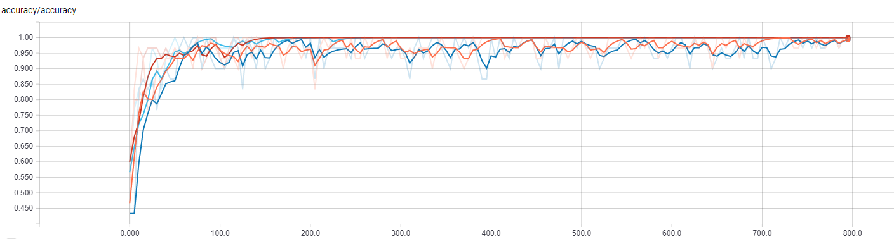
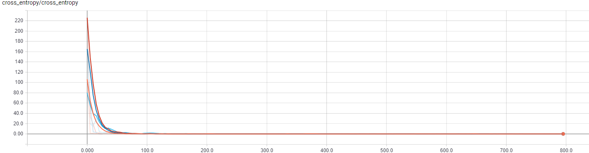
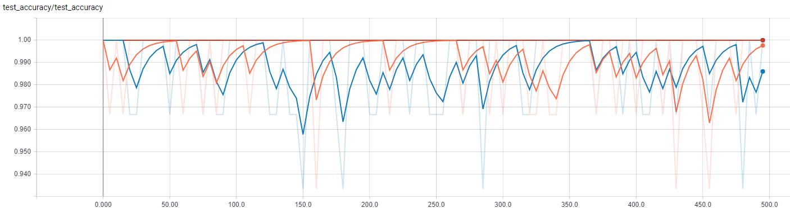

# FF-CNN-Binary-Classification
An experimental feedforward convolutional neural network for binary class image classification using Tensorflow

# Features
1. Classifies an image as either X or an O
2. Uses a single hidden convolution layer
3. Can choose up to 2 fully connected layers
4. Cost function is cross entropy
5. Optimizer is gradient descent with configurable learning rate
6. Controlled dataset of 200 training and 100 test data

# Results
The classifier is configured to train and test using different learning rate and fully connected layer combinations.
Legend:
- orange: Learning rate: 1e-3, fc_count: 1
- blue: Learning rate: 1e-3, fc_count: 2
- red: Learning rate: 1e-4, fc_count: 1
- cyan: Learning rate: 1e-4, fc_count: 2

It can be seen that the 2 models with learning rate of 1e-4 diverged faster and actually hit a training accuracy of 1.0 as early as the 150th step.

It may not be visible in this graph but the orange reached steady state in 0.03, blue in 0.09, red in 1.47e-8 and cyan in 1.4e-7.

Tests results for the models with learning rate 1e-3 had a mean test accuracy of 0.98. The other models had suprisingly perfect test accuracy.

# Future work
1. Add more convolutional layers
2. Increase classification classes
